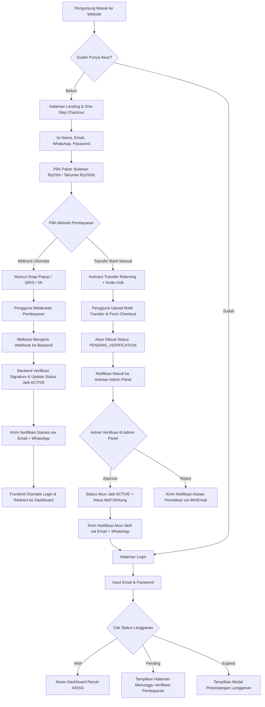
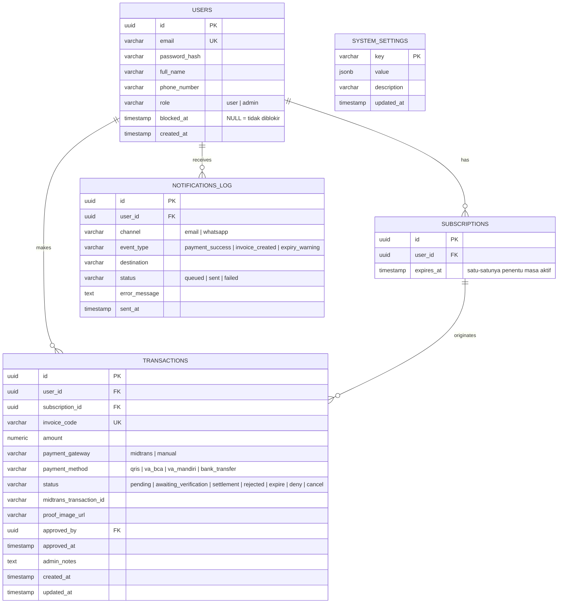
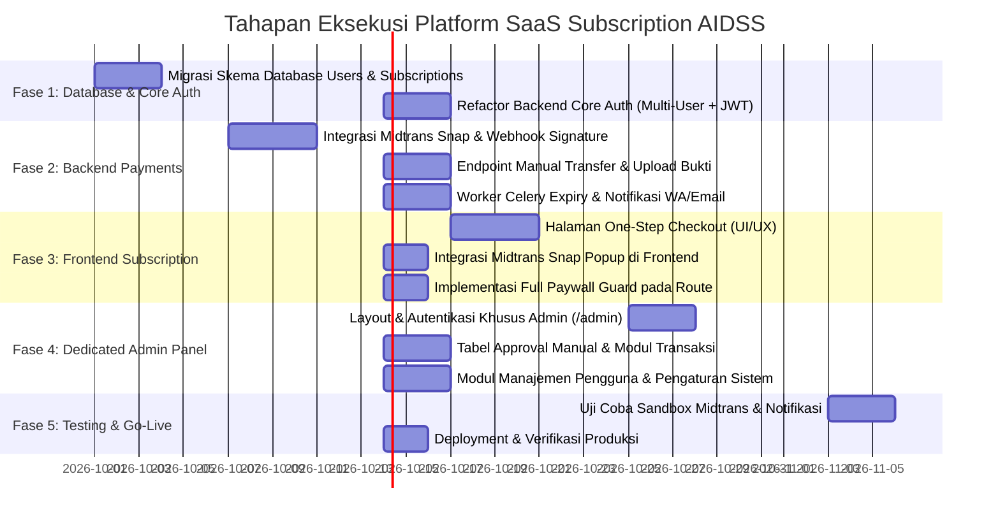

# Spesifikasi Teknis & PRD: Platform Langganan SaaS (AIDSS)

> **Dokumen Arsitektur & Perencanaan Sistem**  
> **Status:** Rencana, sebagian sudah diterapkan. Header versi lama menulis "belum diimplementasikan" untuk seluruh dokumen, dan itu sudah tidak benar: Fase 1 selesai. Yang belum ada adalah penagihan dan seluruh Fase 2. `docs/status.md` tetap satu-satunya sumber kebenaran tentang apa yang benar-benar ada  
> **Versi:** 1.1.0  
> **Target Aplikasi:** AIDSS (AI Investment Decision Support System)  
> **Lokasi File:** `docs/saas-subscription-platform.md`

---

## 1. Ringkasan Eksekutif & Model Bisnis

### 1.1 Latar Belakang
AIDSS saat ini beroperasi sebagai *single-operator personal decision tool*. Untuk mentransformasikannya menjadi produk komersial berbasis langganan (**SaaS B2C/B2B retail**), diperlukan infrastruktur multi-user, sistem penagihan (*billing*), sistem proteksi fitur penuh (*Full Paywall*), portal panel administrasi khusus (*Dedicated Admin Panel*), serta orkestrasi notifikasi otomatis (Email & WhatsApp).

### 1.2 Model Harga & Paket Langganan
| Parameter | Paket Bulanan (*Monthly*) | Paket Tahunan (*Annual*) |
| :--- | :--- | :--- |
| **Harga Normal** | **Rp 15.000 / bulan** | **Rp 150.000 / tahun** |
| **Hemat** | - | Hemat 16,7% (setara 2 bulan gratis) |
| **Masa Aktif** | 30 Hari kalender | 365 Hari kalender |
| **Fitur yang Didapat** | Akses Penuh Seluruh Fitur AIDSS | Akses Penuh Seluruh Fitur AIDSS |
| **Model Perpanjangan**| Manual / Tagihan Berkala | Manual / Tagihan Berkala |

### 1.3 Kebijakan Akses (*Full Paywall Model*)
* **Prinsip Utama:** Pengguna hanya dapat mengakses Dashboard dan seluruh fiturnya jika punya Subscription yang masih berlaku. **Tidak ada kolom status untuk ini** — Subscription tidak pernah menyimpan status pembayaran, dan masa aktifnya dibaca dari tanggal berakhirnya. (_ADR-0002_)
* **Tidak ada peran `subscriber`.** Kelayakan dan otorisasi adalah dua hal terpisah: `role` untuk akses sistem (`user` atau `admin`), dan Subscription untuk akses berbayar. Keduanya boleh dijawab berbeda untuk satu akun yang sama. (_ADR-0002_)
* **Pengguna Non-Subscriber / Tamu:** Jika belum login atau masa aktif habis, seluruh rute dashboard (`/`, `/markets`, `/portfolio`, `/signals`, `/advisor`, `/risk`, dll.) otomatis diarahkan (*redirect*) ke **Landing Page / One-Step Checkout Form**.
* **Keamanan API:** Seluruh endpoint data di backend dilindungi oleh pemeriksaan akses yang membaca Subscription dari database. Pemeriksaan ini **fail-closed**: kalau cache tidak tersedia, akses ditolak, bukan diloloskan. (_ADR-0004_)

---

## 2. Arsitektur Sistem & Alur Kerja (*System Architecture*)

### 2.1 Diagram Alur Pengguna (*User Journey Flow*)



### 2.2 Integrasi Stack Teknologi
* **Backend:** FastAPI (Python 3.11+), Pydantic v2, SQL mentah + asyncpg, Celery + Redis. **Tanpa ORM** —[_ADR-0001_](adr/0001-tetap-raw-sql-tanpa-orm.md)
* **Frontend:** React 18, Vite, TypeScript, Tailwind CSS, Radix UI / shadcn, Sonner (Toasts).
* **Database:** TimescaleDB / PostgreSQL 15.
* **Payment Gateway:** Midtrans Core API / Snap SDK (QRIS GoPay/ShopeePay, BCA/Mandiri/BNI/BRI Virtual Account).
* **Direct Transfer:** Upload bukti transfer ke Object Storage (Local Storage / Cloudflare R2 / S3).
* **Notifikasi:**
  * **Email:** Resend API / SMTP transaksional.
  * **WhatsApp:** Provider Gateway API (Fonnte / Wablas / Starsender / Twilio).

---

## 3. Desain Database (*Database Schema & Migrations*)

Setiap tabel baru harus ditulis di **dua tempat**: `backend/db/schema.sql` untuk instalasi baru, dan `backend/db/migrations/0005_*.sql` untuk database yang sudah ada. Keduanya wajib karena `db-init` hanya menerapkan `schema.sql`. Lihat [_ADR-0001_](adr/0001-tetap-raw-sql-tanpa-orm.md).



### 3.1 DDL PostgreSQL (`backend/db/schema.sql` dan `backend/db/migrations/0005_*.sql`)

```sql
-- ── 1. Tabel Users ─────────────────────────────────────────────────────────
-- Fase 1. Nama email dinormalisasi (lower + trim) oleh Pydantic, dan
-- keunikan ditegakkan ulang oleh indeks ekspresi di bawah, jadi email dengan
-- huruf kapital berbeda tidak bisa menjadi dua akun.
CREATE TABLE IF NOT EXISTS users (
    id            UUID PRIMARY KEY DEFAULT gen_random_uuid(),
    email         VARCHAR(255) NOT NULL,
    password_hash VARCHAR(255) NOT NULL,   -- Argon2id, bukan sandi polos
    full_name     VARCHAR(150) NOT NULL,
    phone_number  VARCHAR(30)  NOT NULL,   -- wajib: satu-satunya kanal notifikasi
    role          VARCHAR(20)  NOT NULL DEFAULT 'user' CHECK (role IN ('user', 'admin')),
    blocked_at    TIMESTAMPTZ,             -- NULL = tidak diblokir
    created_at    TIMESTAMPTZ  NOT NULL DEFAULT NOW()
);

CREATE UNIQUE INDEX IF NOT EXISTS idx_users_email_lower ON users (lower(email));
CREATE INDEX IF NOT EXISTS idx_users_role ON users (role);

-- CATATAN: tidak ada akun sistem yang di-seed di sini. schema.sql dijalankan
-- otomatis oleh db-init pada setiap `docker compose up`, jadi kredensial di
-- dalam file ini akan ikut tersalin ke setiap instalasi. Admin pertama dibuat
-- lewat skrip pemeliharaan.

-- ── 2. Tabel Sessions (opaque, bukan JWT) ───────────────────────────────────
-- id menyimpan SHA-256 dari nilai yang ada di cookie, bukan nilai itu sendiri,
-- sehingga bocornya isi tabel tidak langsung berarti pembocoran sesi aktif.
CREATE TABLE IF NOT EXISTS sessions (
    id         VARCHAR(64) PRIMARY KEY,    -- hex sha-256 dari token cookie
    user_id    UUID NOT NULL REFERENCES users(id) ON DELETE CASCADE,
    created_at TIMESTAMPTZ NOT NULL DEFAULT NOW(),
    expires_at TIMESTAMPTZ NOT NULL
);

CREATE INDEX IF NOT EXISTS idx_sessions_user_id ON sessions(user_id);
CREATE INDEX IF NOT EXISTS idx_sessions_expires_at ON sessions(expires_at);

-- ── 3. Tabel Subscriptions ─────────────────────────────────────────────────
-- Satu baris per periode pembelian, tidak pernah dimutasi. Perpanjangan
-- membuat baris baru, bukan menggeser tanggal yang lama. Tidak ada kolom
-- status: masa aktif dibaca dari expires_at, dan pembatalan tidak ada karena
-- masa aktif yang sudah ditulis tidak bisa dicabut (_ADR-0002_).
-- plan_type dan price_paid menyusul di Fase 2, bersamaan dengan pembayaran.
CREATE TABLE IF NOT EXISTS subscriptions (
    id         UUID PRIMARY KEY DEFAULT gen_random_uuid(),
    user_id    UUID NOT NULL REFERENCES users(id) ON DELETE CASCADE,
    expires_at TIMESTAMPTZ NOT NULL
);

CREATE INDEX IF NOT EXISTS idx_subscriptions_user_access
    ON subscriptions (user_id, expires_at DESC);

-- ── 4. Tabel Transactions ──────────────────────────────────────────────────
-- FASE 2. Alur uang sepenuhnya: apa yang sudah dibayar, menunggu verifikasi
-- admin, ditolak, atau kedaluwarsa. Tidak ada kolom di sini yang menyentuh
-- hak akses.
CREATE TABLE IF NOT EXISTS transactions (
    id                     UUID PRIMARY KEY DEFAULT gen_random_uuid(),
    user_id                UUID NOT NULL REFERENCES users(id) ON DELETE CASCADE,
    subscription_id        UUID REFERENCES subscriptions(id) ON DELETE SET NULL,
    invoice_code           VARCHAR(50) NOT NULL UNIQUE,
    amount                 NUMERIC(14,2) NOT NULL,
    payment_gateway        VARCHAR(30) NOT NULL CHECK (payment_gateway IN ('midtrans', 'manual')),
    payment_method         VARCHAR(50) NOT NULL,
    status                 VARCHAR(30) NOT NULL DEFAULT 'pending' CHECK (status IN ('pending', 'settlement', 'expire', 'deny', 'cancel')),
    midtrans_transaction_id VARCHAR(100),
    proof_image_url        TEXT,
    approved_by            UUID REFERENCES users(id),
    approved_at            TIMESTAMPTZ,
    admin_notes            TEXT,
    created_at             TIMESTAMPTZ NOT NULL DEFAULT NOW(),
    updated_at             TIMESTAMPTZ NOT NULL DEFAULT NOW()
);

CREATE INDEX IF NOT EXISTS idx_transactions_user ON transactions (user_id);
CREATE INDEX IF NOT EXISTS idx_transactions_status ON transactions (status);
CREATE INDEX IF NOT EXISTS idx_transactions_invoice ON transactions (invoice_code);

-- ── 5. Tabel System Settings (Dinamis: Rekening & Harga) ── FASE 2 ─────────
CREATE TABLE IF NOT EXISTS system_settings (
    key         VARCHAR(100) PRIMARY KEY,
    value       JSONB NOT NULL,
    description TEXT,
    updated_at  TIMESTAMPTZ NOT NULL DEFAULT NOW()
);

-- Inisialisasi konfigurasi awal
INSERT INTO system_settings (key, value, description) VALUES
('pricing', '{"monthly": 15000, "annual": 150000}', 'Harga paket langganan dalam IDR'),
('bank_accounts', '[
  {"bank": "BCA", "account_number": "1234567890", "holder_name": "PT AIDSS Finansial Teknologi"},
  {"bank": "Mandiri", "account_number": "9876543210", "holder_name": "PT AIDSS Finansial Teknologi"}
]', 'Rekening tujuan transfer manual'),
('contact_support', '{"whatsapp": "081234567890", "email": "support@aidss.id"}', 'Kontak layanan pelanggan')
ON CONFLICT (key) DO NOTHING;

-- ── 6. Tabel Notification Logs ── FASE 2 ───────────────────────────────────
CREATE TABLE IF NOT EXISTS notification_logs (
    id            UUID PRIMARY KEY DEFAULT gen_random_uuid(),
    user_id       UUID REFERENCES users(id) ON DELETE CASCADE,
    channel       VARCHAR(20) NOT NULL CHECK (channel IN ('email', 'whatsapp')),
    event_type    VARCHAR(50) NOT NULL,
    destination   VARCHAR(255) NOT NULL,
    payload       JSONB,
    status        VARCHAR(20) NOT NULL DEFAULT 'queued' CHECK (status IN ('queued', 'sent', 'failed')),
    error_message TEXT,
    sent_at       TIMESTAMPTZ
);
```

---

## 4. Alur One-Step Checkout & Autentikasi Pengguna

### 4.1 Desain Formulir One-Step Checkout (`/checkout` atau `/subscribe`)
Untuk meminimalkan *drop-off* calon pelanggan, alur checkout didesain dalam satu halaman ringkas:

1. **Bagian 1: Data Pengguna Baru**
   * Nama Lengkap (`full_name`)
   * Alamat Email (`email`) — Digunakan untuk login dan pengiriman invoice.
   * Nomor WhatsApp (`phone_number`) — Format Indonesia (`08...` / `628...`) untuk notifikasi instan.
   * Kata Sandi (`password`) — Minimal 8 karakter.
2. **Bagian 2: Pilihan Paket Langganan**
   * Radio Card: **Bulanan (Rp 15.000 / bln)**
   * Radio Card: **Tahunan (Rp 150.000 / thn)** — Dilengkapi badge penanda *🔥 Paling Hemat (Hemat 16,7%)*.
3. **Bagian 3: Pilihan Pembayaran (Hybrid)**
   * **Opsi A (Instan / Otomatis):** Midtrans Snap (QRIS Instant, GoPay, OVO, ShopeePay, Virtual Account BCA, Mandiri, BRI, BNI).
   * **Opsi B (Manual Transfer):** Transfer Rekening Bank Perusahaan (BCA / Mandiri) + Unggah Foto Bukti Transfer.
4. **Ringkasan Total Pembayaran & Tombol "Bayar Sekarang"**

### 4.2 Siklus Pembayaran Midtrans (Otomatis)
1. Frontend mengirim payload ke `POST /v1/auth/signup`. Di Fase 1 endpoint ini hanya membuat akun, tanpa pembayaran; checkout pindah ke Fase 2.
2. Backend membuat record `user`, `subscription` (`pending`), `transaction` (`pending`), lalu memanggil Midtrans Snap API untuk memperoleh `snap_token`.
3. Frontend membuka dialog pembayaran `window.snap.pay(snapToken, { onSuccess: ..., onPending: ... })`.
4. Saat pembayaran diverifikasi oleh bank/QRIS, Midtrans mengirimkan HTTP POST Webhook ke Backend: `POST /v1/payments/midtrans/webhook`.
5. Backend memvalidasi signature SHA-512:
   $$\text{Signature} = \text{SHA512}(\text{order\_id} + \text{status\_code} + \text{gross\_amount} + \text{ServerKey})$$
6. Jika valid dan status transaksi `settlement`:
   * Status transaksi diubah menjadi `settlement`.
   * Status langganan diubah menjadi `active`, `start_date = NOW()`, `end_date = NOW() + INTERVAL '30 days'` (atau 365 hari).
   * Celery memicu background task `send_notification_task` (Email invoice via Resend + WhatsApp via API).
   * Frontend mendeteksi pembayaran selesai, melakukan otomatisasi login, dan langsung mengarahkan pengguna ke Dashboard AIDSS.

### 4.3 Siklus Pembayaran Transfer Manual
1. Jika pengguna memilih Transfer Manual, formulir menampilkan detail rekening bank tujuan serta nominal yang harus ditransfer.
2. Pengguna mengunggah gambar bukti transfer (`.jpg`, `.png`, `.pdf` max 5MB).
3. Backend menyimpan berkas bukti pembayaran, membuat akun user dengan status langganan `pending`.
4. Pengguna diarahkan ke layar **"Pembayaran Sedang Diverifikasi"** lengkap dengan kontak konfirmasi WhatsApp Admin.
5. Transaksi otomatis muncul di antrean verifikasi **Admin Panel** (`/admin/transactions`).
6. Begitu Admin menekan tombol **"Approve"**:
   * Status langganan berubah menjadi `active` dengan masa aktif terhitung sejak waktu approval.
   * Sistem otomatis mengirim pesan WhatsApp & Email: *"Halo [Nama], pembayaran Anda telah disetujui! Akun Anda sudah aktif, silakan login di https://app.aidss.id"*.

---

## 5. Portal Panel Admin Khusus (*Dedicated Admin Portal*)

Panel admin diletakkan pada **route/portal terpisah** dari antarmuka dashboard pengguna utama:
* **Route Portal:** `/admin` (misal `/admin/login`, `/admin/dashboard`, `/admin/users`, `/admin/transactions`, `/admin/settings`).
* **Proteksi Akses:** `AdminGuard` yang memvalidasi `user.role === 'admin'`. Pengguna non-admin akan ditolak dengan respons *403 Forbidden*.
* **Tampilan Khusus (*Dedicated Layout*):** Navigasi sidebar terpisah dari menu analisis saham, dengan struktur menu sendiri. **Portal admin mengikuti tema default aplikasi (light) beserta toggle dark yang berfungsi sama seperti dashboard pengguna**; ia tidak mendapat tema gelap tersendiri. Keputusan pemilik: admin portal mengikuti light default. Lihat `DESIGN.md` bagian Theme.

### 5.1 Modul-Modul di Admin Panel

```
Admin Portal (/admin)
├── 1. Dashboard Eksekutif (/admin)
│   ├── Metrik MRR (Monthly Recurring Revenue)
│   ├── Total Subscriber Aktif vs Churned
│   ├── Pendapatan Hari Ini, Bulan Ini, dan Total Akumulasi
│   └── Badge Peringatan Antrean Verifikasi Tertunda (Pending Queue)
├── 2. Manajemen Transaksi & Verifikasi (/admin/transactions)
│   ├── Tab 'Menunggu Verifikasi Manual' (Pending Approval)
│   │   ├── Preview Bukti Transfer (Modal Zoomable Image)
│   │   ├── Tombol "Setujui" (1-Click Approve & Trigger Notifikasi)
│   │   └── Tombol "Tolak" (Reject dengan modal input alasan)
│   └── Tab 'Riwayat Semua Transaksi' (Midtrans & Manual, Filter Status, Export CSV)
├── 3. Manajemen Pengguna & Langganan (/admin/users)
│   ├── Tabel Pengguna (Nama, Email, No WA, Paket, Tanggal Berakhir, Status)
│   ├── Fitur Perpanjang Manual (Subscription baru, bukan menggeser tanggal lama)
│   ├── Fitur Nonaktifkan / Blokir Akun
│   └── Reset Password Pengguna
└── 4. Pengaturan Sistem (/admin/settings)
    ├── Pengaturan Harga Paket (Bulanan & Tahunan)
    ├── Manajemen Rekening Bank Manual (Tambah/Edit No Rekening & Atas Nama)
    └── Pengaturan Kunci API (Midtrans, Gateway WhatsApp, SMTP Email)
```

---

## 6. Spesifikasi REST API & Webhook

### 6.1 Endpoint Publik & Checkout
| Method | Endpoint | Deskripsi | Akses |
| :--- | :--- | :--- | :--- |
| `POST` | `/v1/auth/signup` | Registrasi Akun. Di Fase 1 tanpa pembayaran | Publik |
| `POST` | `/v1/auth/login` | Login Email & Password, mereturn JWT + Role + Sub Status | Publik |
| `POST` | `/v1/auth/refresh` | Refresh JWT Token | Authenticated |
| `GET`  | `/v1/subscriptions/pricing` | Ambil harga aktif & daftar rekening tujuan | Publik |
| `POST` | `/v1/payments/midtrans/webhook` | Webhook HTTP POST dari Midtrans | Server-to-Server |
| `POST` | `/v1/payments/manual/upload-proof` | Upload berkas bukti transfer manual | Authenticated/Public |

### 6.2 Endpoint Pelanggan (Protected Subscriber)
| Method | Endpoint | Deskripsi | Akses |
| :--- | :--- | :--- | :--- |
| `GET`  | `/v1/user/profile` | Profil akun dan sisa masa aktif langganan | Subscriber Aktif |
| `POST` | `/v1/user/renew` | Inisiasi perpanjangan — membuat Subscription baru | Subscriber |
| `GET`  | `/v1/user/invoices` | Riwayat pembayaran & invoice PDF | Subscriber |

### 6.3 Endpoint Admin Portal (Protected `role: admin`)
| Method | Endpoint | Deskripsi | Akses |
| :--- | :--- | :--- | :--- |
| `GET`  | `/v1/admin/analytics/overview` | Metrik MRR, total pendapatan, subscriber aktif | Admin |
| `GET`  | `/v1/admin/transactions/pending` | Daftar transaksi manual yang butuh approval | Admin |
| `POST` | `/v1/admin/transactions/{id}/approve` | Setujui transfer manual & aktifkan masa langganan | Admin |
| `POST` | `/v1/admin/transactions/{id}/reject` | Tolak transfer manual disertai catatan alasan | Admin |
| `GET`  | `/v1/admin/users` | Daftar seluruh user + filter status & pencarian | Admin |
| `POST` | `/v1/admin/users/{id}/grant-subscription` | Membuat Subscription baru (perpanjangan) | Admin |
| `PUT`  | `/v1/admin/settings/pricing` | Perbarui nominal harga bulanan & tahunan | Admin |
| `PUT`  | `/v1/admin/settings/bank-accounts` | Perbarui daftar rekening bank transfer manual | Admin |

---

## 7. Pekerjaan Latar Belakang & Notifikasi (*Background Jobs & Notifications*)

Sistem memanfaatkan scheduler **Celery Beat** yang sudah ada di proyek untuk menjalankan otomasi berkala:

### 7.1 Jadwal Celery Beat (`backend/workers/celery_app.py`)

Tidak ada task kedaluwarsa langganan, dan ini disengaja. Masa aktif dibaca dari `expires_at`, jadi tidak ada yang perlu ditandai — task `check_and_expire_subscriptions` yang pernah direncanakan di sini **dibatalkan** (_ADR-0002_). Kalau akses dihitung dari kolom status, task inilah yang akan menulis status basi, dan pembayaran yang masukabutuh satu hari sebelum jadwal berjalan akan salah ditandai.

Yang tetap perlu task hanyalah pengiriman notifikasi, dan itu Fase 2:

```python
beat_schedule = {
    # Pengingat perpanjangan H-3
    "send-renewal-reminders-daily": {
        "task": "workers.subscription_worker.send_renewal_reminders",
        "schedule": crontab(hour=9, minute=0),
    },
}
```

Zona waktu mengikuti konvensi yang sudah ada di `backend/workers/celery_app.py`: jam dalam WIB, dengan `enable_utc=True`.

### 7.2 Template Pesan Notifikasi Otomatis (Email + WhatsApp)

#### Template 1: Pembayaran Berhasil & Akun Aktif
* **Email:** HTML Invoice formal berlogo AIDSS, rincian paket, tanggal kedaluwarsa, dan tautan akses dashboard.
* **WhatsApp:**
  ```text
  Halo {{full_name}}, selamat datang di AIDSS! 🚀
  
  Pembayaran langganan paket {{plan_name}} (Rp{{amount}}) telah BERHASIL diverifikasi.
  Akun Anda kini telah AKTIF hingga: {{end_date}}.
  
  Silakan login langsung untuk mengakses AI Signals, Portfolio Risk, dan AI Advisor:
  🔗 https://app.aidss.id/login
  
  Terima kasih atas kepercayaan Anda.
  Tim AIDSS
  ```

#### Template 2: Pengingat Perpanjangan H-3 Sebelum Expired
* **WhatsApp:**
  ```text
  Halo {{full_name}}, masa aktif langganan AIDSS Anda akan berakhir dalam 3 hari ({{end_date}}).
  
  Agar akses analisis sinyal AI dan rekomendasi portofolio Anda tidak terputus, Anda dapat memperpanjang paket langganan Anda melalui tautan berikut:
  🔗 https://app.aidss.id/renew
  
  Butuh bantuan? Balas pesan ini untuk terhubung langsung dengan Admin kami.
  ```

---

## 8. Aspek Keamanan & Penanganan Fraud (*Security & Hardening*)

1. **Pencegahan Bypass JWT:**
   * Token disimpan sebagai cookie `HttpOnly` + `Secure` + `SameSite=Lax`, **bukan** di `localStorage`. Nilainya 64 karakter acak; database menyimpan `SHA-256` dari nilai itu, bukan nilai aslinya (_ADR-0004_).
   * Tidak ada klaim apa pun di dalam token. `role` dan Subscription dibaca dari database pada setiap request. Konsekuensinya: mencabut akses atau memblokir akun berlaku seketika, tanpa menunggu token kedaluwarsa.
   * Redis hanya read-through cache untuk sesi, dan pemeriksaan aksesnya **fail-closed**. Kalau cache tidak tersedia, akses ditolak, bukan diloloskan — kelalaian di sini akan membuka semua data ke siapa pun yang punya token lama.
   * Sesi kedaluwarsa tidak otomatis dihapus. Pembersihan lewat skrip pemeliharaan, bukan Celery Beat, supaya tidak menambah trap zona waktu baru ke jadwal yang sudah pernah salah.
   * Ganti kata sandi menghapus seluruh sesi akun tersebut.
   * WebSocket memakai tiket sekali pakai berumur pendek, diambil lewat HTTP yang sudah diautentikasi. Browser tidak bisa mengirim header saat handshake, dan query param bocor ke access log.
2. **Validasi Webhook Midtrans:**
   * Wajib mencocokkan SHA-512 `signature_key` yang dihitung server. Request tanpa signature yang valid langsung ditolak dengan status HTTP 400/403.
   * Bersifat *idempotent*: Jika Midtrans mengirim webhook berulang kali untuk ID transaksi yang sama, status tidak akan dihitung ganda.
3. **Keamanan Upload Berkas:**
   * Gambar bukti transfer divalidasi tipe MIME aslinya (`image/jpeg`, `image/png`, `application/pdf`).
   * Batas ukuran berkas maksimal 5 MB.
   * Nama berkas disanitasi menggunakan UUID acak untuk mencegah kerentanan *Path Traversal*.
4. **Password Security:**
   * Password di-hash dengan **Argon2id** lewat `argon2-cffi`. `passlib` tidak dipakai: proyek tidak pernah memasangnya, backend bcrypt-nya rusak terhadap versi bcrypt modern, dan paketnya tidak lagi dirawat.

---

## 9. Roadmap Implementasi Bertahap (*Implementation Roadmap*)



### Rincian Fase:
* **Fase 1 (Database & Auth Multi-User):** Membuat migrasi tabel `users`, `subscriptions`, `transactions`, `system_settings`, dan `notification_logs`. Mengganti sistem login hardcoded single-operator di `backend/api/routers/auth.py` menjadi multi-user database auth.
* **Fase 2 (Payment Service Backend):** Membuat router `checkout.py` dan `payments.py`, menghubungkan SDK Midtrans, endpoint upload bukti transfer, dan service notifikasi (Resend Email + WhatsApp Gateway).
* **Fase 3 (Frontend User Onboarding & Paywall):** Membangun komponen `OneStepCheckout.tsx`, integrasi script Midtrans Snap, serta middleware/guard di `App.tsx` yang memblokir akses dashboard jika user belum memiliki langganan aktif.
* **Fase 4 (Dedicated Admin Portal):** Membangun antarmuka `/admin` dengan menu Dashboard Ringkasan Finansial, Tabel Approval Bukti Transfer dengan image preview, dan Manajemen Masa Aktif Pelanggan.
* **Fase 5 (Testing & Quality Assurance):** Pengujian skenario pembayaran sukses, pembayaran gagal, kedaluwarsa otomatis, penolakan bukti transfer palsu, dan verifikasi responsivitas mobile.

---

## 10. Kesimpulan
Dokumen ini menjadi cetak biru (*blueprint*) acuan teknis lengkap untuk mengonversi AIDSS dari proyek personal menjadi platform SaaS komersial mandiri berpendapatan berulang (*Recurring Revenue*) dengan biaya berlangganan terjangkau (Rp15.000/bln dan Rp150.000/thn), didukung otomatisasi Midtrans serta fleksibilitas transfer bank lokal manual.
